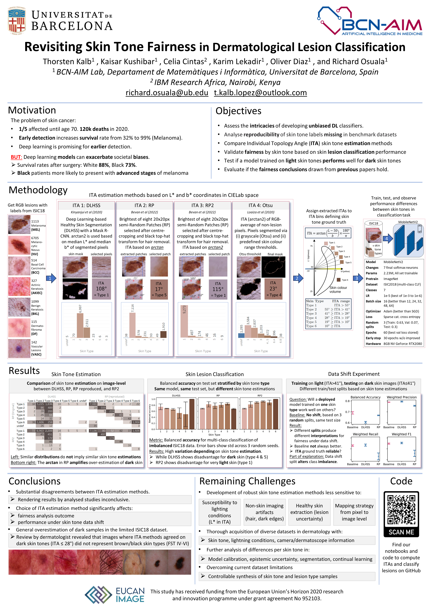

# Revisiting Skin Tone Fairness in Dermatology
This repository contains the code to reproduce the experiments in the paper "[Revisiting Skin Tone Fairness in Dermatological Lesion Classification](https://arxiv.org/abs/2308.09640v1)", accepted at the [FAIMI workshop 2023](https://faimi-workshop.github.io/2023-miccai/) @ MICCAI 2023.

## Summary

## Data
The dataset is the ISIC18 dataset (Task 3). It can be downloaded [here](https://challenge.isic-archive.com/data/#2018). The images should be in the same folder as the metadata.csv.

The skin tone estimations based on the Individual Topology Angle (ITA) with the Deep Learning-based Healthy Skin Segmentation (DLHSS), the ITA labels provided by the authors of [Kinyanjui et al.](https://link.springer.com/chapter/10.1007/978-3-030-59725-2_31) are the estimated_ita in the metadata.csv (data/.../metadata.csv).

For the skin tone estimation with Random Patch approaches, with arctan (RP) and with arctan2 (RP2), the code in the BevanCorrection notebook has been slightly adapted from [Bevan et Atapour-Abarghouei](https://github.com/pbevan1/Detecting-Melanoma-Fairly).

## Results:
The results and their visualisations can be reproduced with the predictions folder and with the Results_Plots notebook.
Results regarding the comparison of skin tone estimates, prior to lesion classification, have been created with Tableau and can be reproduced with the Bevan_corrected.csv (RP,RP2) and with the ITA labels within the metadata.csv.

## Experimental Setup:
The experiments including the model training and grid search optimization of the MobileNetV2 are in the python files "\*Baseline\*.py" and "\*DataShift\*.py".

Also the optimization of the baseline classifier has been included in the 00Baseline02GridOptimization.py
